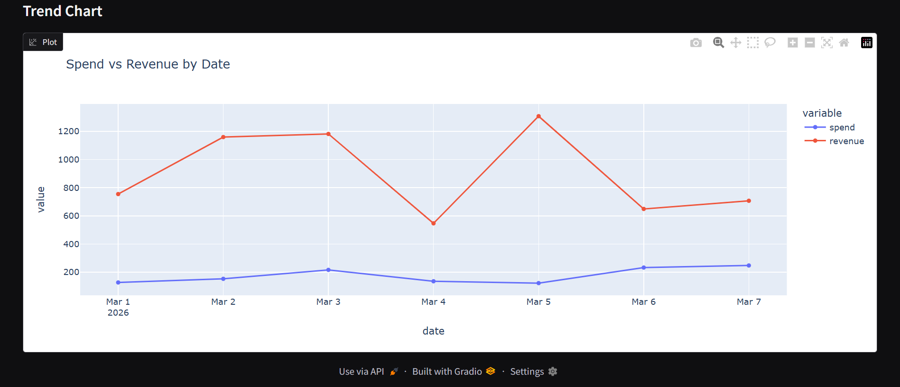

<h1 align="center">Analytics Dashboard Prototype</h1>

A lightweight dashboard prototype that demonstrates how marketing and sales data
can be integrated, transformed, and visualized in a single analytics interface.

<h2>Project Overview</h2>

This project builds a simple analytics dashboard that simulates combining data from
<strong>Meta Ads (Facebook Ads)</strong> and <strong>SamCart</strong> to generate useful
business insights. The system retrieves platform data, transforms it into a unified
dataset, calculates performance metrics, and displays results through an interactive UI.

<h2>Why Gradio UI</h2>

The dashboard interface is built using <strong>Gradio</strong> to enable rapid
development of an interactive web UI directly from Python. This approach allows the
focus to remain on <strong>data processing, API integration, and metric computation</strong>
without requiring complex frontend development.

<h2>Methodology</h2>

The application follows a simple analytics pipeline:

<ul>
<li><strong>Data Retrieval</strong> – Simulated API data for Meta Ads and SamCart</li>
<li><strong>Data Transformation</strong> – Data is structured and merged using pandas</li>
<li><strong>Metric Calculation</strong> – Key KPIs such as Spend, Revenue, ROAS, CPA, and Conversion Rate</li>
<li><strong>Visualization</strong> – Results are displayed in tables and trend charts</li>
</ul>

<h2>Inputs</h2>

<ul>
<li>Start Date</li>
<li>End Date</li>
<li>Load Dashboard Button</li>
</ul>

These inputs allow users to query analytics data for a selected time range.

<h2>Outputs</h2>

<ul>
<li><strong>KPI Metrics Table</strong> – Summary of marketing performance</li>
<li><strong>Merged Dataset</strong> – Combined marketing and sales data</li>
<li><strong>Trend Chart</strong> – Visualization of spend vs revenue over time</li>
</ul>

<h2>Implementation</h2>

<pre>
analytics-dashboard/
│
├── app.py
├── data_sources.py
├── transform.py
├── requirements.txt
└── README.md
</pre>

<ul>
<li><strong>data_sources.py</strong> – Retrieves marketing and sales data</li>
<li><strong>transform.py</strong> – Handles data processing and KPI calculations</li>
<li><strong>app.py</strong> – Implements the Gradio dashboard interface</li>
</ul>

<h2>Tech Stack</h2>

<ul>
<li>Python</li>
<li>Gradio</li>
<li>Pandas</li>
<li>Plotly</li>
<li>Requests</li>
</ul>

<h2>Run the Project</h2>

<pre><code>
pip install -r requirements.txt
python app.py
</code></pre>

<h2>Summary</h2>

This project demonstrates a fast prototype for integrating marketing and sales data
into a unified analytics dashboard. Using Gradio enabled a quick implementation while
keeping the focus on data processing, metric computation, and clear presentation of insights.

